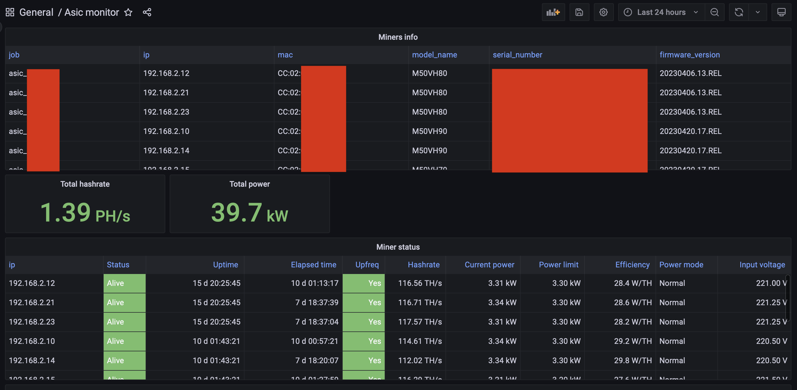

# Prometheus asic metrics exporter

Exporter for the [Prometheus metrics](https://prometheus.io/) based on [Pyasic](https://github.com/UpstreamData/pyasic) library. Currently tested only with Whatsminer M50 series. Should work with all generations.

## Install via docker

Docker image is here: https://hub.docker.com/r/vaa12345/prometheus-asic

Example docker-compose.yml:

```yml
version: '3'
services:
  prometheus_asic-exporter:
    image: vaa12345/prometheus-asic:0.1
    container_name: prometheus_asic-exporter
    environment:
       - ASIC_IP_RANGE=192.168.2.1-192.168.2.254
    ports:
      - "127.0.0.1:9904:9904"
    restart: unless-stopped
```

Define ASIC_IP_RANGE environment variable for your network

Other optional variables:
- `ASIC_REFRESH_INTERVAL`: (Optional) The refresh interval of the metrics. The default is `60` seconds.
- `ASIC_EXPORTER_PORT`: (Optional) The address the exporter should listen on. The default is `9904`.
- `ASIC_EXPORTER_ADDRESS`: (Optional) The address the exporter should listen on. The default is to listen on all addresses.

Add collector to prometheus.yml config
```shell
  - job_name: asic_youlocation
    scrape_interval: 60s
    static_configs:
    - targets: ['localhost:9904']
```
scrape_interval is 60 second by default in asic exporter and defined via ASIC_REFRESH_INTERVAL. Don't set this value too low. Depending on the number of your ASICs, it takes time to receive data. Usually from 15 to 30 seconds.

If you have more than one locations you can specify different job_name and filter by them in Grafana.

## Grafana dashboard

Example of Grafana dashboard in Asic monitor-1688539764005.json file


